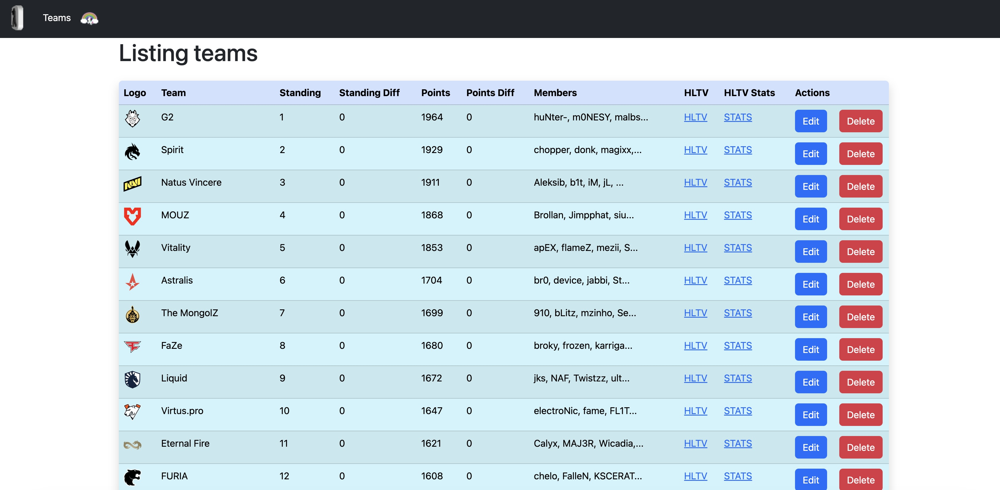

# CS2 App (Counter-Strike 2)
This is a simple app that fetches data from Valve (ranking)
and HLTV (teams and players - assets and stats) and stores it in db.

## Requirements
* Ruby (see `.ruby-version` for version)
* Using [rbenv](https://github.com/rbenv/rbenv) is a good idea
* [Pre-Commit](https://pre-commit.com/)


## Installation

* Once ruby is installed:
```bash
gem install bundler
bundle install
bundle exec rake db:setup
```

* Fetch ranking from Valve (generates `lib/data/ranking_data.json`):
```bash
bundle exec rake ranking:fetch
```

* Fetch teams and players data from HLTV (generates `lib/data/hltv_data.json`):
```bash
bundle exec rake hltv:fetch
```

* Import data to the database
* Populate assets
  * teams logos`assets/images/teams`
  * players images`assets/images/players`
```bash
bundle exec rake import:all
```

* Start the server:
```bash
bundle exec rails s
```
# Screenshot

# TODO
* Add tests
* Automagically update rankings and calculate differences
* Update teams and players (transfer players)
* UI improvements
